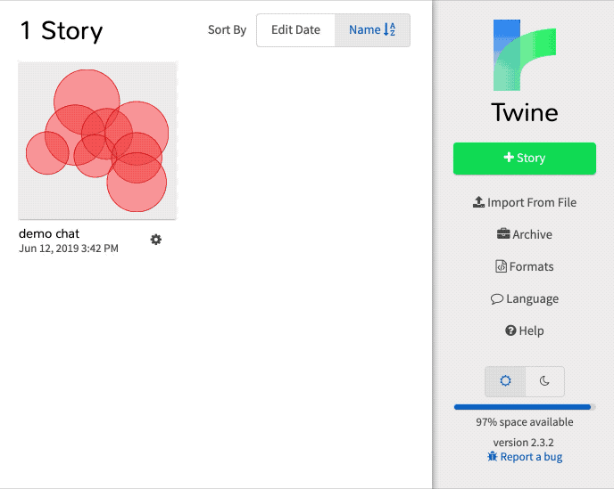
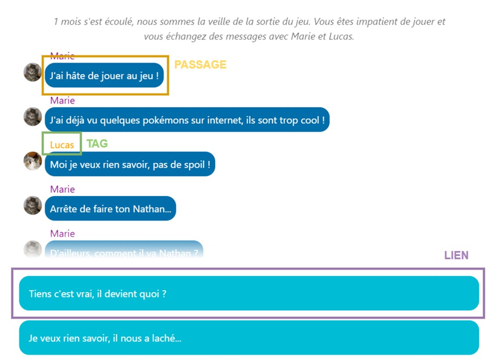
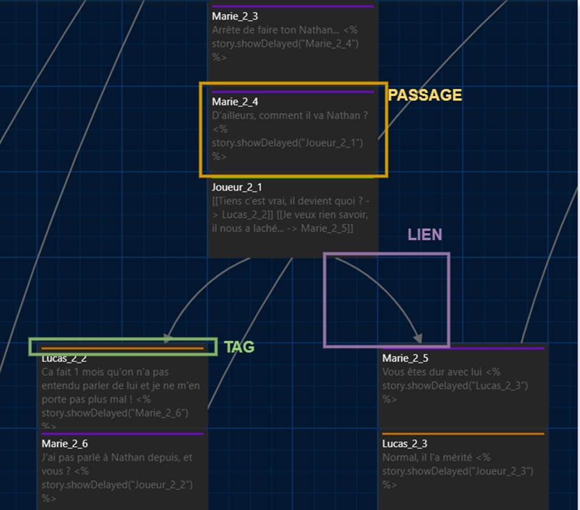

# C'est quoi un Story Format ?

Définition d’un story format : “Un Story Format est un code JavaScript qui lit, analyse et modifie l'histoire produite par Twine pour afficher une représentation visuelle pour les joueurs.” 

Une histoire exportée par Twine a besoin d’un Story Format pour être lue par un navigateur. 
Chaque Story format permet de modifier l’apparence de l’histoire à sa manière. 

La manière dont le projet Twine est codé dépend du Story Format choisi. 

# Comment créer un Story Format

# Ajout d'un Story Format custom à Twine

Lien du Story Format SkitStory : https://defisantejeunesse-skit.github.io/SkitFormat/dist/SkitFormat/format.js

Exemple d'ajout de Story Format à Twine :


# Utiliser SkitFormat dans Twine

Documentation Twine : https://twinery.org/cookbook/index.html 

Licence Twine : https://twinery.org/cookbook/#license  

Structure de l'application exportée par Twine :



Structure de l'histoire dans l'editeur Twine :


Déclaration d'une variable globale : 
```html 
<% s.haskey = false %> 
```

Condition sur variable globale : 
```html
<% if (s.haskey) { %> 
… code if 
<% } else { %> 
… code else 
<% } %>
``` 

# Documentation supplémentaire : 

Twine cookbook : https://twinery.org/cookbook 

HTML outputs & Story formats specs : https://github.com/iftechfoundation/twine-specs 

Tuto youtube Story Format : https://www.youtube.com/playlist?list=PLlXuD3kyVEr5jWoG0oDygKWOgFC3qrKN- 

Créer son propre Story Format : https://videlais.com/2020/02/28/creating-your-own-twine-2-story-format-part-1-understanding-twine-2-html-structures/ 

Repo du custom story format du tuto : https://github.com/videlais/example-story-format 

Twine guide : https://twinery.org/reference/en/index.html  